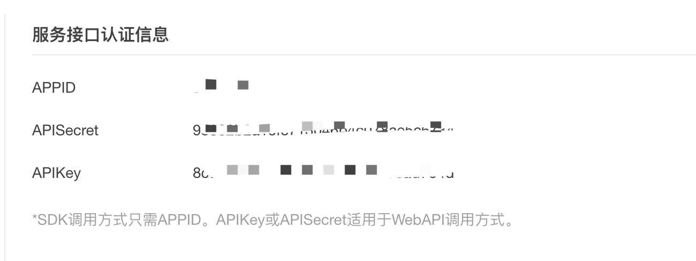

TEST
## 网抑云视频生成器

### 原作者 B 站 objtube 的卢克儿 [B 站主页](https://space.bilibili.com/5104803?spm_id_from=333.788.b_765f7570696e666f.1) [原仓库链接](https://github.com/ObjTube/wyy-videoGen)

> 半成品，仅供娱乐学习

## 运行

### 先配置科大讯飞 api 秘钥

[讯飞开放平台](https://www.xfyun.cn/services/voicedictation?ch=bdtg&renqun_youhua=646957)上可以注册使用，注册成功并创建一个应用后即可获得



配置完成后

```
 npm install
 npm start
```

## 文件说明

- aduio: 保存讯飞音频
- srt: 保存生成的字幕
- wyyVideo: 保存最后合成的视频文件
